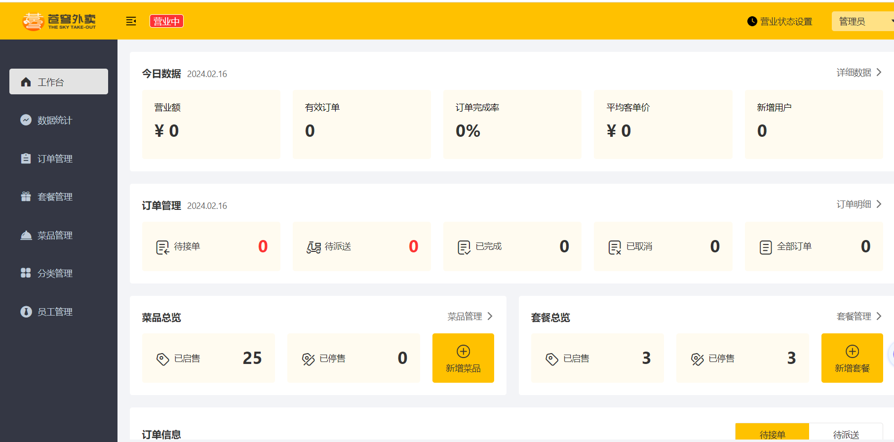
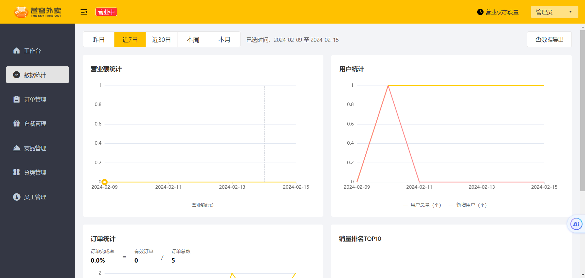
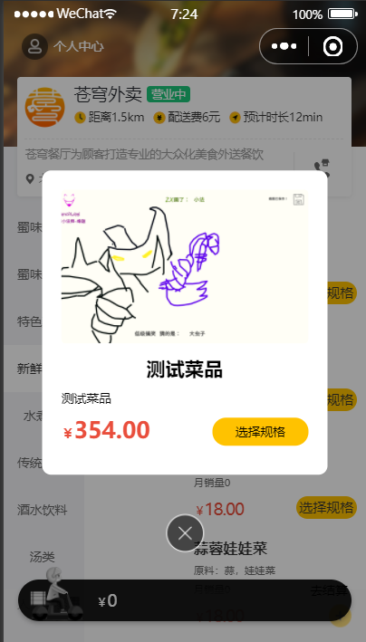
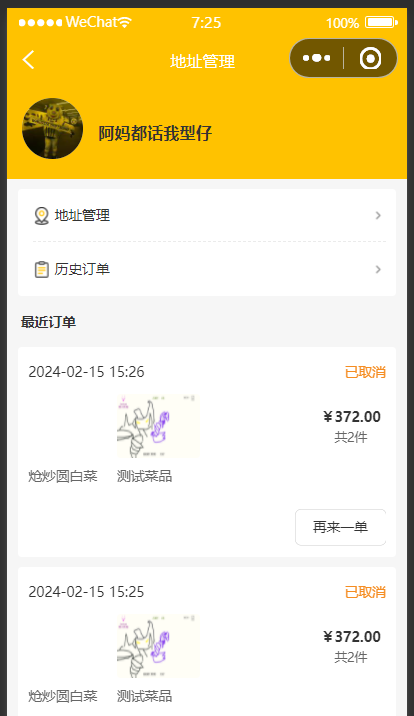
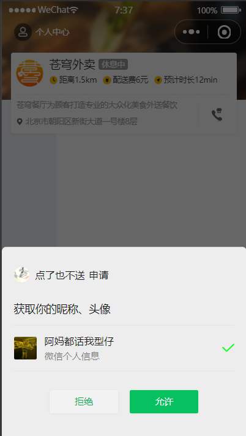

黑马程序员 `Blibli` 中的苍穹外卖项目，用于自学。

## 技术栈

前端技术栈：`Vue`

后端技术栈：`Spring Boot`，`Redis`，`WebSocket`，`MyBatis`，`MySQL`

项目搭建使用：`Maven`，`Nginx`

资源存储需要用到阿里云提供的 `OSS` 服务

## 项目说明
这个项目及仓库均为本人自学使用，具体实现教程和搭建可以参考原教程地址 <a href="https://www.bilibili.com/video/BV1TP411v7v6/?spm_id_from=333.788.top_right_bar_window_default_collection.content.click&vd_source=e97aa2010f3160ce0f914c86e0917314">黑马苍穹外卖</a>。

按照教程实现可以了解**数据库->后端服务器->前端服务器**整个流程。其中涉及到某些常用技术如 `Redis` 等。

## 实现效果
管理端效果如下

用户端效果如下

 

